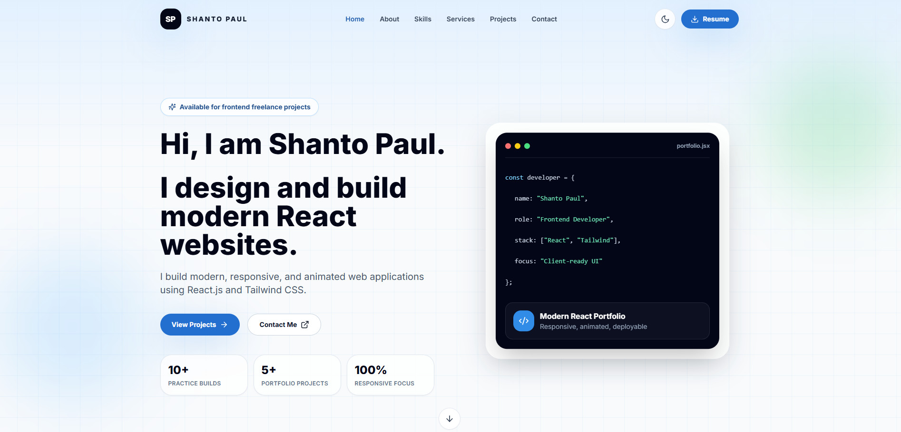
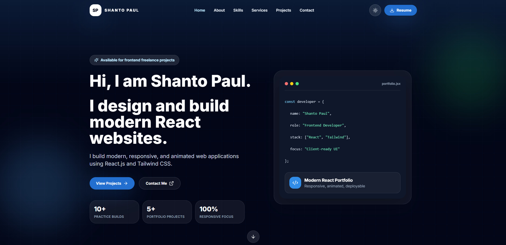
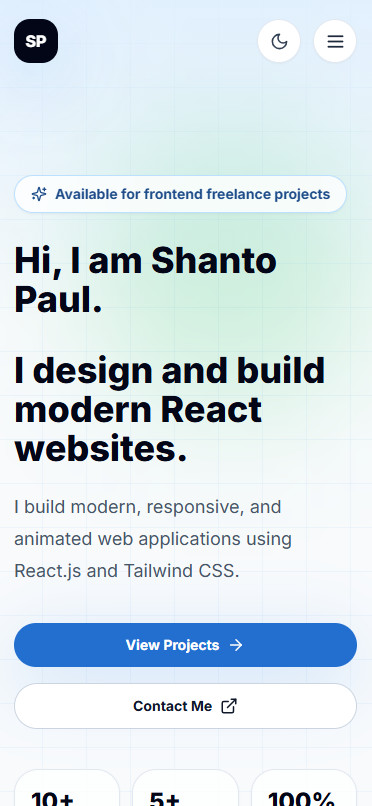
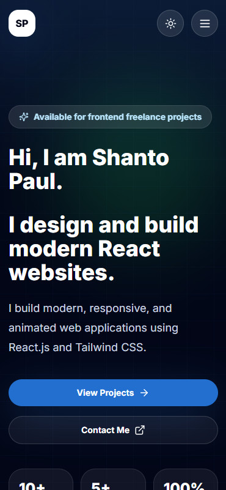

# Shanto Paul - Professional Personal Portfolio

Modern, responsive, and production-ready personal portfolio website for a frontend developer. Built to showcase professional UI design, React development skills, responsive layouts, smooth animations, real project cards, downloadable resume, and a working EmailJS contact form.

**Live Website:** <a href="https://personal-portfolio.shantopaul.com/" target="_blank" rel="noopener noreferrer">personal-portfolio.shantopaul.com</a>

**Repository:** [github.com/shantopaul/Professional-Personal-Portfolio](https://github.com/shantopaul/Professional-Personal-Portfolio)

## Preview

### Desktop - Light Theme



### Desktop - Dark Theme



### Mobile - Light and Dark Theme

| Light Theme | Dark Theme |
| --- | --- |
|  |  |

## Project Highlights

- Professional frontend developer portfolio
- Fully responsive layout for desktop, tablet, and mobile
- Light and dark theme support
- Theme preference saved in `localStorage`
- Sticky navigation with smooth scrolling
- Mobile hamburger navigation
- Animated hero section with Framer Motion
- About, Skills, Services, Projects, Testimonials, Contact, and Footer sections
- Project cards with tech stack, live demo, and GitHub buttons
- Functional EmailJS contact form
- Form validation, loading state, success message, and API error feedback
- Downloadable one-page resume PDF
- SEO metadata, favicon, and Open Graph preview
- Vercel-ready production configuration
- Clean reusable React component structure

## Tech Stack

| Category | Technology |
| --- | --- |
| Frontend | React.js, Vite |
| Styling | Tailwind CSS |
| Animation | Framer Motion |
| Icons | Lucide React, React Icons |
| Contact Form | EmailJS |
| Deployment | Vercel |
| Version Control | Git, GitHub |

## Main Sections

- **Navbar:** Sticky responsive navigation, active section highlighting, resume button, theme toggle, and mobile menu.
- **Hero:** Professional introduction, strong CTA buttons, animated visual card, and responsive layout.
- **About:** Personal introduction, development focus, learning journey, education, and freelancing goals.
- **Skills:** Frontend skills, tools, currently learning technologies, progress indicators, and icons.
- **Services:** Frontend development, React development, landing pages, responsive design, bug fixing, and redesign services.
- **Projects:** Responsive project grid with preview images, descriptions, tech stacks, demo links, and GitHub links.
- **Testimonials:** Client-style trust cards with avatars and star ratings.
- **Contact:** EmailJS-powered form with validation and delivery status feedback.
- **Footer:** Brand name, navigation links, social links, and copyright.

## Getting Started

### 1. Clone the Repository

```bash
git clone https://github.com/shantopaul/Professional-Personal-Portfolio.git
cd Professional-Personal-Portfolio
```

### 2. Install Dependencies

```bash
npm install
```

### 3. Configure Environment Variables

Create a `.env` file in the project root:

```env
VITE_EMAILJS_SERVICE_ID=your_service_id
VITE_EMAILJS_TEMPLATE_ID=your_template_id
VITE_EMAILJS_PUBLIC_KEY=your_public_key
```

The `.env` file is ignored by Git and should not be committed.

### 4. Start Development Server

```bash
npm run dev
```

Open:

```text
http://localhost:5173
```

## Available Scripts

```bash
npm run dev
```

Start the local development server.

```bash
npm run build
```

Create a production build in the `dist` folder.

```bash
npm run lint
```

Run ESLint checks.

```bash
npm run preview
```

Preview the production build locally.

## Project Structure

```text
Professional-Personal-Portfolio/
|-- assets/
|   `-- screenshots/
|       |-- desktop-light.jpg          # README preview: desktop light theme
|       |-- desktop-dark.jpg           # README preview: desktop dark theme
|       |-- mobile-light.jpg           # README preview: mobile light theme
|       `-- mobile-dark.jpg            # README preview: mobile dark theme
|
|-- public/
|   |-- Shanto Paul Resume.pdf         # Downloadable one-page resume
|   |-- favicon.svg                    # Browser favicon
|   `-- og-preview.svg                 # Open Graph/social preview image
|
|-- scripts/
|   `-- create-resume-pdf.mjs          # Script to regenerate the resume PDF
|
|-- src/
|   |-- components/
|   |   |-- Navbar.jsx                 # Sticky navigation, mobile menu, resume button
|   |   |-- Hero.jsx                   # Hero intro, CTA buttons, animated code card
|   |   |-- About.jsx                  # About section, stats, background cards
|   |   |-- Skills.jsx                 # Skill groups, icons, progress bars
|   |   |-- Services.jsx               # Client service cards
|   |   |-- Projects.jsx               # Project grid with demo and GitHub links
|   |   |-- Testimonials.jsx           # Client review cards
|   |   |-- Contact.jsx                # EmailJS contact form and validation
|   |   |-- Footer.jsx                 # Footer navigation and social links
|   |   |-- ThemeToggle.jsx            # Light/dark mode toggle button
|   |   `-- SectionHeader.jsx          # Reusable section heading component
|   |
|   |-- data/
|   |   |-- profile.js                 # Name, role, email, resume URL, social links
|   |   |-- skills.js                  # Skill categories and progress values
|   |   |-- services.js                # Service card data
|   |   |-- projects.js                # Project card data
|   |   `-- testimonials.js            # Testimonial/review data
|   |
|   |-- hooks/
|   |   `-- useTheme.jsx               # Theme context and localStorage persistence
|   |
|   |-- App.jsx                        # Main page composition
|   |-- main.jsx                       # React application entry point
|   `-- index.css                      # Tailwind imports and global component classes
|
|-- .env.example                       # Example EmailJS environment variables
|-- .gitattributes                     # Marks PDF assets as binary
|-- .gitignore                         # Ignores node_modules, dist, .env files
|-- eslint.config.js                   # ESLint configuration
|-- index.html                         # Vite HTML shell with SEO metadata
|-- package.json                       # Dependencies and npm scripts
|-- package-lock.json                  # Locked dependency versions
|-- postcss.config.js                  # PostCSS/Tailwind processing config
|-- tailwind.config.js                 # Tailwind theme, colors, shadows, dark mode
|-- vercel.json                        # Vercel build/output/security headers config
`-- vite.config.js                     # Vite React and build configuration
```

## EmailJS Setup

The contact form uses EmailJS for frontend-only email delivery. No backend server is required. The form sends these fields from `src/components/Contact.jsx`:

```js
{
  from_name: form.name,
  from_email: form.email,
  subject: form.subject,
  message: form.message
}
```

### 1. Create an EmailJS Account

1. Go to [EmailJS](https://www.emailjs.com/).
2. Create a free account.
3. Open the EmailJS dashboard.
4. Confirm the free request limit shown in the dashboard.

### 2. Create an Email Service

1. Go to **Email Services**.
2. Click **Add New Service**.
3. Select **Gmail** or another supported provider.
4. Connect the email account that should send portfolio messages.
5. Allow the requested permission to send email.
6. Save the service.

After saving, copy the **Service ID**.

Example:

```env
VITE_EMAILJS_SERVICE_ID=service_xxxxx
```

### 3. Create an Email Template

1. Go to **Email Templates**.
2. Click **Create New Template**.
3. Add a professional template name, for example:

```text
Portfolio Contact Form
```

4. Use this subject:

```text
New portfolio message from {{from_name}} - {{subject}}
```

5. Use this email body:

```text
You received a new message from your portfolio website.

Name: {{from_name}}
Email: {{from_email}}
Subject: {{subject}}

Message:
{{message}}
```

### 4. Configure Template Settings

Recommended template fields:

| Field | Value |
| --- | --- |
| To Email | Your receiving email address |
| From Name | `{{from_name}}` or your portfolio name |
| From Email | Default EmailJS/service email |
| Reply To | `{{from_email}}` |
| Subject | `New portfolio message from {{from_name}} - {{subject}}` |

Required template variables:

```text
{{from_name}}
{{from_email}}
{{subject}}
{{message}}
```

After saving, copy the **Template ID**.

Example:

```env
VITE_EMAILJS_TEMPLATE_ID=template_xxxxx
```

### 5. Get the Public Key

1. Go to **Account**.
2. Open the **General** tab.
3. Find **API Keys**.
4. Copy the **Public Key**.

Example:

```env
VITE_EMAILJS_PUBLIC_KEY=public_key_xxxxx
```

Do not use the EmailJS private key in this frontend project.

### 6. Add Local Environment Variables

Create a `.env` file in the project root:

```env
VITE_EMAILJS_SERVICE_ID=service_xxxxx
VITE_EMAILJS_TEMPLATE_ID=template_xxxxx
VITE_EMAILJS_PUBLIC_KEY=public_key_xxxxx
```

Restart the development server after changing `.env`:

```bash
npm run dev
```

### 7. Add Environment Variables in Vercel

For production deployment:

1. Open the Vercel project dashboard.
2. Go to **Settings**.
3. Go to **Environment Variables**.
4. Add all three variables:

```env
VITE_EMAILJS_SERVICE_ID=service_xxxxx
VITE_EMAILJS_TEMPLATE_ID=template_xxxxx
VITE_EMAILJS_PUBLIC_KEY=public_key_xxxxx
```

5. Enable them for **Production**, **Preview**, and **Development** if needed.
6. Redeploy the project.

### 8. Test the Contact Form

Use the live website or local development server:

```text
https://personal-portfolio.shantopaul.com/
```

Submit a test message:

```text
Name: Test User
Email: test@example.com
Subject: Portfolio Test
Message: This is a test message from the portfolio contact form.
```

Expected result:

```text
Message sent successfully. I will reply as soon as possible.
```

Then check:

- Receiving email inbox
- Spam folder
- EmailJS **Email History**

### 9. Troubleshooting

| Problem | Meaning | Fix |
| --- | --- | --- |
| `EmailJS environment variables are missing` | `.env` values are not loaded | Add `.env` and restart `npm run dev` |
| `Gmail_API: Request had insufficient authentication scopes` | Gmail did not give EmailJS enough send permission | Disconnect Gmail in EmailJS, remove EmailJS from Google Account permissions, reconnect, and allow all requested permissions |
| `404` from EmailJS API | Wrong service ID, template ID, or SDK setup | Confirm IDs and use `@emailjs/browser` |
| No email received but success appears | Email may be filtered | Check spam, promotions, all mail, and EmailJS history |
| Works locally but not on Vercel | Env variables missing in Vercel | Add variables in Vercel settings and redeploy |

### 10. Security Notes

- `.env` is ignored by Git.
- Never commit EmailJS private keys.
- EmailJS Public Key is designed for browser-side usage.
- Keep EmailJS templates limited to contact-form use.
- Restrict allowed domains in EmailJS settings when available.

## Deployment

This project is configured for Vercel.

### Vercel Settings

| Setting | Value |
| --- | --- |
| Framework Preset | Vite |
| Build Command | `npm run build` |
| Output Directory | `dist` |
| Install Command | `npm install` |

Add the EmailJS environment variables in Vercel Project Settings before deploying.

Live production URL:

<a href="https://personal-portfolio.shantopaul.com/" target="_blank" rel="noopener noreferrer">https://personal-portfolio.shantopaul.com/</a>

## Quality Checks

Before deployment, run:

```bash
npm run build
npm run lint
```

Current project status:

- Production build passing
- ESLint passing
- Deployed on Vercel
- Contact form connected with EmailJS
- Responsive light and dark themes available

## Security Notes

- `.env` and `.env.local` are ignored by Git.
- EmailJS private key is not used in the frontend.
- Only EmailJS public browser configuration is used in the deployed app.
- Resume PDF is stored as a public static asset.
- Vercel deployment headers are configured in `vercel.json`.

## Branch Workflow

This project was implemented with a professional feature-branch workflow. Major branches included:

- `feature-project-foundation`
- `feature-navigation-hero`
- `feature-content-sections`
- `feature-contact-polish`
- `feature-resume-pdf-download`
- `feature-emailjs-browser-sdk-fix`
- `feature-professional-readme`

Each feature branch was merged into `main` after implementation and verification.

## Contributions

Contributions are welcome. Anyone can suggest or work on:

- New portfolio features
- UI/UX improvements
- Responsive design fixes
- Accessibility improvements
- Performance optimization
- Bug fixes
- Documentation improvements

### How to Contribute

1. Fork the repository.
2. Create a new feature branch.
3. Make the change with clean, readable code.
4. Run the quality checks:

```bash
npm run build
npm run lint
```

5. Open a pull request with a clear description of the change.

### Contributors

| Name | Email | Role |
| --- | --- | --- |
| Shanto Paul | [shanto@shantopaul.com](mailto:shanto@shantopaul.com) | Project Owner, Frontend Developer |

## Contact

**Shanto Paul**  
Frontend Developer  
Email: [shanto@shantopaul.com](mailto:shanto@shantopaul.com)  
GitHub: [github.com/shantopaul](https://github.com/shantopaul)
